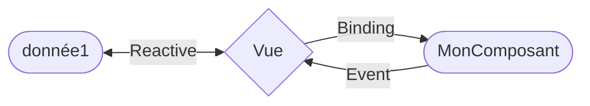

# Développer avec <span vue-brand>Vue</span>

<div
  v-motion
  :initial="{ y: 80 }"
  :enter="{ y: 0 }">

## JOUR 1

</div>

---
layout: image-right
image: https://upload.wikimedia.org/wikipedia/commons/9/95/Vue.js_Logo_2.svg
---
## Son histoire

Créé en **2014 par Evan You** pour construire rapidement une application web sans prise de tête.

Devenu viral, il a grandi en gardant sa simplicité mais en permettant de monter en complexité progressivement.

> Il se considère **évolutif** pour sa capacité à s'adapter aux besoins techniques

Aujourd'hui, il culmine parmi les plus grands framework JS utilisés (avec React, Angular, Svelte et SolidJS).

<!--
  Evolutif pour deux raisons:
  - Intégration: il peux s'utiliser sans outils de build via un usage script (à la jQuery tout en bénéficiant du système de template)
  - Programmatique: Options API vers Composition API qui présente une nette évolution en termes de complexité
-->

---
title: Framework ou Librairie ?
level: 2
layout: fact
hideInToc: true
---
# Framework <small>ou</small> Librairie ?

<v-click>

<h3 animate-pulse>Une petite explication s'impose</h3>

</v-click>

---
layout: image-right
hideInToc: true
image: /framework-library.svg
---

## Framework / Librairie

<span my-2 text-gray font-bold font-mono>Framework</span> : Ensemble de règles imposées techniquement pour guider un travail à effectuer.

<span my-2 text-gray font-bold font-mono>Librairie</span> : Ensemble de solutions techniques prêtes à l'emploi

<br>

Malgré son apparence de librairie,  
**<span vue-brand>Vue</span> se positionne comme un framework grâce à son écosystème**.

<!--
Vue seul représente le noyau apportant le minimum nécessaire pour
bénéficier de la réactivité sur les vues utilisateur.

Grâce aux projets officiels et communautaires autour de lui, il devient un framework imposant certaines règles mais gardant toujours l'ouverture nécessaire pour substituer les parties agrémentées
-->

---
layout: image-right
class: my-auto
title: Ses forces vives
level: 2
image: /vue-hero.png
---
## <span uppercase>Ses forces vives</span>

#### pour te rendre productif et efficace


<div
  v-motion
  v-motion-slide-visible-bottom
  class="mt-4 -ml-6"
>

<Toc mode="filterOnlyCurrentTree" minDepth="3" maxDepth="3" />

</div>


<!-- 
- Les données conduisent les vues : tout changement dans la vue doit être un effet d'un changement de données et non par un changement manuellement effectuer (comme on pourrait le faire avec jQuery). Cela permet d'avoir une représentation fidèle du modèle de donnée dans la vue.
- Le templating a plusieurs avantages dont la fluidité dans son écriture et l'optimisation au runtime. Le templating permet d'organiser la vue en lien avec les données et Vue propose des outils pour rendre l'organisation la moins verbeuse.
- Les données descendent sous forme de props ou de contexte (stage management, inject) mais ne peuvent remontées de la même manière: elles remontent via les événements issus de changements d'état ou d'interaction utilisateur
-->
---
---
### Composants guidés par les données

L'un des principes fondamentaux de Vue certifie que les données soient toujours bien représentées dans la vue.
Se reposant sur le principe `MVVC` (Model-View-ViewModel), Vue propose de simplifier cela via un système de réactivité.

<div grid grid-cols-2>
  <div>
  <v-click hide>

  

  </v-click>


  <div m4 relative bottom-40 v-after>



  <small>

  `Reactive` : Système de réactivité  
  `Binding` : Liaison utilisant le *Virtual DOM*  
  `Event` : Remontée d'événements

  </small>
  </div>

  </div>

<div>
<v-click>

Ainsi, il est interdit de :

- Modifier directement le DOM
- Respecter la responsabilité des composants

</v-click>
<v-click >
  <div ml-6 text-8px>

  > Ne pas modifier directement les props  
  > Ne pas modifier les props du parent

  </div>
</v-click>

</div>
</div>

---
layout: image-left
image: https://atomicdesign.bradfrost.com/images/content/atomic-design-process.png
split: 1/3
---

La composition dans une application consiste en l'utilisation de plusieurs composantes pour former un organisme muni de corps inter-dépendants.

L'[Atomic Design](https://atomicdesign.bradfrost.com/chapter-2/) suggère un découpage à l'image de la composition chimique en assurant la responsabilité de chacun.

<v-clicks>

- **Atome** : une entité simple ayant une sémantique unique et réutilisable  
  <small>bouton, champ texte, icône</small>
- **Molécule** : atomes assemblés pour une sémantique flexible et réutilisable  
  <small>champ avec label, table avec champ de recherche</small>
- **Organisme** : ensemble complexe d'atomes ou/et de molécules (voire d'autres organismes) de sémantiques différentes  
  <small>en-tête d'application, section d'application</small>

</v-clicks>

---
---
### Templating et ses astuces

Vue adopte un système de templating pour 4 grandes raisons :

<Toc mode="filterOnlyCurrentTree" minDepth="4" maxDepth="4" />

<Reference to="guide/essentials/template-syntax.html" title="Reference syntaxe de template" absolute />

---
---

#### pouvoir utiliser le DOM comme template
> Vue en mode **html**

```html {all|2-11|4-10|all}
<div id="root">
  <section>
    <h1>{{name}}</h1>
    <nav :class="{ hidden: list.length === 0 }">
      <ul>
        <li v-for="item in list">
          {{item}}
        </li>
      </ul>
    </nav>
  </section>
</div>
```

Ce template peut tout à fait être intégré tel quel dans du HTML, le navigateur peut l'interpréter sans erreur.

<v-click>

Vue peut se monter sur un template *inline* et y ajouter la réactivité et les interactions nécessaires.

```ts
  const app = createApp()

  app.mount('#root')
```

</v-click>

---
hideInToc: true
---

#### pouvoir utiliser le DOM comme template
> Vue en mode **application**

```html
<!-- L'ancre de montage -->
<div id="root"></div>
```

```vue
<!-- menu.vue -->
<template>
  <section>
    <h1>{{name}}</h1>
    <nav :class="{ hidden: list.length === 0 }">
      <ul>
        <li v-for="item in list">{{item}}</li>
      </ul>
    </nav>
  </section>
</template>
```

<v-click>

Toute l'application App est montée sur le point de montage.

```ts
  const app = createApp(App)

  app.mount('#root')
```

</v-click>

---
layout: two-cols
---

#### garder une séparation nette entre la vue et les données

Le web c'est l'HTML, le CSS et le Javascript.

L'HTML peut fonctionner seul, sans Javascript.  
Le CSS aussi.

Respecter les responsabilités de chacun assure une bonne organisation, et permet une meilleure pérennité du code.

<v-click>


</v-click>


::right::

<v-click>
<div pl-4>

Les **composants monofichiers**, <br>ou les [Single-File Component (SFC)](https://vuejs.org/guide/scaling-up/sfc.html), apportent l'union des trois au sein d'un même fichier.

```vue {all|11-13|15-20|1-9} {at: 2}
<script>
export default {
  data() {
    return {
      greeting: 'Hello World!'
    }
  }
}
</script>

<template>
  <p class="greeting">{{ greeting }}</p>
</template>

<style>
.greeting {
  color: red;
  font-weight: bold;
}
</style>
```

</div>
</v-click>
<!-- "Le CSS aussi" : Référence aux solution CSS-in-JS très coûteuse au runtime -->

---
---

#### proposer un sucre syntaxique facile à retenir

À la différence du JavaScript, le templating est extensible <br>et propose l'abstraction des fonctionnalités du framework tout en se reposant sur l'HTML.

Voici une liste des fonctions les plus pratiques utilisable via le template :

<Toc mode="filterOnlyCurrentTree" minDepth="5" />

---
layout: iframe-right
url: https://sfc.vuejs.org/#eNqNUctOwzAQ/JXFl4DUxKLApUorHjek/oEvIdm2LvEDex2Eovw7dlOhkEoI+eSdGc/MumdP1hZdQLZiJaGybUW4ERqgPNxu+h6yF6wloCcIGhR6X+0RpG6lRvBUkfwImMEwlDzyk26iVX5/iSwT4rCqSXa4PT94Yi1HX6ltIOhyZRps14LNuIIBj8SST9L+75S+dtISeKRgo0oqaxxBSrODAXbOKMjiKrIxbG10bJ06rCF7NuFogoMWQRndIFzBa1xAkP5nC0XUjZp5u3VyuM62Ri7geFY1X7pSo+wmtRmzbdiCjbFyVdni6I2OH9OfAp0BL9gKTpM0i3HTXbADkfUrzoO27/uiNoo/Roy7oEkqzBujHu+KZXH/wBvpaTov0Kv8zZlPjy46CraYPM7jsEOXO4ylHbo/zWbcX4Yz7MI0eQ5CD2z4BjsD5HQ=
---
##### Interpolation de texte <Reference to="guide/essentials/template-syntax.html#text-interpolation" title="Référence syntaxe de template" />

Pour rendre une variable de type texte dans le template via les moustaches `{{ ... }}`.

Le contenu doit être une expression javascript.
<!-- Voir le rendu JS pour avoir une idée de la gestion sous jascente -->
---
layout: iframe-right
url: https://sfc.vuejs.org/#eNp9UtFu2zAM/BVOe8gGNDbQtdvgukO279CLYrGZG1sSJLpLEPjfR0mWl7bAAMMyj0fxjuZF/HSueplQNKINne8d/ZBGGjw56wk0PqlpILhIA6AVqU+f8zeAR5q8KRHAGA4NbH5Z82wnDwPCaI1G+LC5KQw6O2TKfiKy5h8c6Dwwvl4EsFfd8eDtZDTTP3799n1TcvNaNSh/QN8A+QlX8HevNZoGntQQMINzPPjFT1tfGWwJRzcoQo4A2iwKOEOSmqj0UYp4SJHvaZJMBtNZ0G5QITCYxKJeyQVnU/FCSVkuC81hFrqEcynbdUPfHbksp+ExuYtZGUVHyuXCc56TqbbOojnT1lduOEwaU8XiKw1X0t56HYd2604Q7NBrOHg8P3AqDyl/VIub8kty1dYr3U+hgTt3enjNz+YK3Smte8PLcP+OuPhaiLoPrPncgLEGC5N/UhIvbkQ/xh3cjspVz8Ea3tBsY0kEKdatkYJXOMY8OyIXmrqejDseqs6O9Y5ztZ8M9SNutR13X6rb6u6+5v50jVcYxu3e2z8BPXeUYtmrdHnN4EucAvJoPPr/NnvDfdXwTe5d07KvYv4LcaIxow==
---
##### Liaison de données réactives

Comme déjà mentionné, Vue utilise le binding via un un système de réactivité pour lier une donnée à la vue.

La réactivité se repose sur les [Proxys](https://developer.mozilla.org/fr/docs/Web/JavaScript/Reference/Global_Objects/Proxy).

---
layout: fact
title: Réactivité ou Immutabilité
level: 5
hideInToc: true
---
# Réactivité <small>ou</small> Immutabilité ?

---
title: Réactivité ou Immutabilité
level: 5
layout: two-cols-header
hideInToc: true
---
# Réactivité <small>ou</small> Immutabilité ?

<style>h1 { text-align: center }</style>

::left::

<v-click fade hide>
<div>

La réactivité est une manière de gérer les données, et c'est d'ailleurs la plus naturelle de le faire.

Il s'agit de modifier la valeur directement, quelle soit constante ou non.

```js
let texte = 'Bonjour'
const article = { nom: 'Sac' }

texte += ' !'
article.prix = 0.85
```

Vue (ainsi que Angular, Svelte et Solid) le pratique pour aligner les changements côté client automatiquement.

**Un inconvénient existe :**<br> pour des développeurs non avertis, il peut vite arriver des surprises avec les référence.

</div>
</v-click>

::right::

<v-after>

L'immutabilité est inspirée du monde fonctionnel où pour modifier une donnée, il faut en retourner une nouvelle.

```js
const article = { nom: 'Sac' }
function ajouterPrix (prix) {
  return {
    ...article,
    prix
  }
}
const newArticle = ajouterPrix(0.85);
```

Une sécurité dans la manipulation de la donnée au détriment de la simplicité.

**Un inconvénient existe :**<br> performance au runtime pouvant être moindre

</v-after>

---
---
##### Rendu conditionnel
---
---
##### Rendu de boucles 
---
---
##### Les directives
---
---
#### optimiser la manipulation du DOM
---
---
### Évènements et interactions

---
---
title: Options API ou Composition API ?
level: 2
layout: fact
---
# Options API <small>ou</small> Composition API ?
## De la simplicité à la complétude

---
---
### Les Macros
https://vue-macros.sxzz.moe

---
layout: image-right
image: /vue-tutoriel.png
---
## Mise en pratique

Après la théorie, passons à la pratique.

La documentation Vue propose depuis sa nouvelle version un tutoriel ainsi que des exemples.

**Rendez-vous sur la page [Tutoriel](https://vuejs-docs-fr.netlify.app/tutorial/) de Vue**

<a href="https://vuejs-docs-fr.netlify.app/tutorial/" target="_blank">
  <button bg-vue p="y-2 x-4" text-white dark:text-black hover="opacity-75" uppercase text-xs rounded><carbon-play-outline-filled/> Résoudre les 15 étapes</button>
</a>
